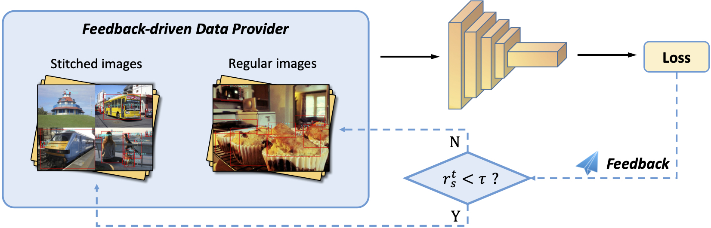

# Stitcher
This project provides the implementation for [Stitcher: Feedback-driven Data Provider for Object Detection](https://arxiv.org/abs/2004.12432).
In this paper, we present Stitcher, a feedback-driven data provider, which aims to train object detectors in a balanced way. In Stitcher, images are resized into smaller components and then stitched into the same size to regular images. Stitched images contain inevitable smaller objects, which is exploited with the loss statistics as feedback to guide next-iteration update. Stitcher steadily improves performance by a large margin in all settings, especially for small objects, with nearly no additional computation in both training and testing stages.



## Installation
- This project is based on [maskrcnn-benchmark](https://github.com/facebookresearch/maskrcnn-benchmark).
Please check INSTALL.md for installation instructions.

## Training and Inference
- Training and inference can be conducted with corresponding default scripts in [maskrcnn-benchmark](https://github.com/facebookresearch/maskrcnn-benchmark).

## Trained Models

### Faster R-CNN with FPN
| Model | period |  AP | AP small | Model |
| --- | :---: | :---: | :---: | :---: |
| ResNet-50 | 1x | 38.6 | 24.4 | [GoogleDrive](https://drive.google.com/file/d/16ypUY_6e4OY3PTTQDxCisWB2bk3QtvHI/view?usp=sharing)|
| ResNet-50 (VOC) | 1x | 81.6 | - | [GoogleDrive](https://drive.google.com/file/d/11nC7cPbpGTApXqh9sEYq3-_rr9eM6lCq/view?usp=sharing)|
| ResNet-101 | 1x | 40.8 | 25.8 | [GoogleDrive](https://drive.google.com/file/d/1_L5pG92ty6l5jTjKJMBOYM9GddVH6y-E/view?usp=sharing)|
| ResNet-50 | 2x | 39.9 | 25.1 | [GoogleDrive](https://drive.google.com/file/d/17letzqt_mHkmz-7YTE786DBIgqQsyk6d/view?usp=sharing)|
| ResNet-101 | 2x | 42.1 | 26.9 | [GoogleDrive](https://drive.google.com/file/d/12ADO5ppSjzISrX7bjSNrZiQan8MYVzZj/view?usp=sharing)|
| ResNext-101 | 1x | 43.1 | 28.0 | [GoogleDrive](https://drive.google.com/file/d/1cH6eu34lu05R50gla5zh-1r3ovvGmk3W/view?usp=sharing)|
| ResNet-101 + DCN | 1x | 43.3 | 27.1 | [GoogleDrive](https://drive.google.com/file/d/1hTyEwjdwe_13tr7uXGjjy760-bTi54Ps/view?usp=sharing)|
| ResNext-101 + DCN | 1x | 45.4 | 29.4 | [GoogleDrive](https://drive.google.com/file/d/1TzBrAz-aH3NauwXYFfJywMXXAoC5ecFT/view?usp=sharing)|


### RetinaNet
| Model | period |  AP | AP small | Model |
| --- | :---: | :---: | :---: | :---: |
| ResNet-50 | 1x | 37.8 | 22.1 | [GoogleDrive](https://drive.google.com/file/d/15148js8u8VbNynjc2MYNxRqogtkN6D_C/view?usp=sharing)|
| ResNet-101 | 1x | 39.9 | 24.7 | [GoogleDrive](https://drive.google.com/file/d/1CAv5XehJdzQXac5xHWO6jscsHA8ooIh9/view?usp=sharing)|
| ResNet-50 | 2x | 39.0 | 23.4 | [GoogleDrive](https://drive.google.com/file/d/1gRYoKGJH0zGD4HbA9P-JIn5RZ2a7IEuu/view?usp=sharing)|
| ResNet-101 | 2x | 41.3 | 25.4 | [GoogleDrive](https://drive.google.com/file/d/19IZ_GrWo-yIIb0cBw4gAfWFuCwHkVlQK/view?usp=sharing)|

### Mask R-CNN
| Model | period |  AP | AP small | Model |
| --- | :---: | :---: | :---: | :---: |
| ResNet-50-FPN | 1x | 35.1 | 17.0 | [GoogleDrive](https://drive.google.com/file/d/1eps3vhW30MQHWvia7fpq5i15JZHFjbcz/view?usp=sharing)|
| ResNet-101-FPN | 1x | 37.2 | 19.0 | [GoogleDrive](https://drive.google.com/file/d/1RaYg7r4iuUQX0pFJwGqVILacP44UWcev/view?usp=sharing)|

### Longer periods
| Model | period |  AP | AP small | Model |
| --- | :---: | :---: | :---: | :---: |
| Baseline | 6x | 35.6 | 19.8 | [GoogleDrive](https://drive.google.com/file/d/1fKtYJp_iW9a7vxQhWQAqgZYcZBAOkC9r/view?usp=sharing)|
| Stitcher | 6x | 40.4 | 26.1 | [GoogleDrive](https://drive.google.com/file/d/1kmn3LdxipCAgOvi8EwCidedWm3eMrjIy/view?usp=sharing)|

### Selection paradigms (Faster R-CNN with FPN in 1x)
| Model | Feedback |  AP | AP small | Model |
| --- | :---: | :---: | :---: | :---: |
| ResNet-50 | Input | 38.1 | 23.1 | [GoogleDrive](https://drive.google.com/file/d/1b0Pjo3A7MysuKEXiRbb3mwHI76upkP3k/view?usp=sharing)|
| ResNet-50 | Cls Loss | 38.5 | 23.9 | [GoogleDrive](https://drive.google.com/file/d/1L17OUnOoH1H-PLYP9mCoyYAWr5XJbzAa/view?usp=sharing)|
| ResNet-50 | Reg Loss | 38.6 | 24.4 | [GoogleDrive](https://drive.google.com/file/d/16ypUY_6e4OY3PTTQDxCisWB2bk3QtvHI/view?usp=sharing)|
| ResNet-50 | Both Loss | 38.5 | 23.7 | [GoogleDrive](https://drive.google.com/file/d/1bnUj-Ca9xnf9p0FA9fyvPEm4pWOyXlrr/view?usp=sharing)|

### Batch Dimension Stitcher (Faster R-CNN with FPN in 1x)
| Model | k |  AP | AP small | Model |
| --- | :---: | :---: | :---: | :---: |
| ResNet-50 | 2 | 38.3 | 22.9 | GoogleDrive|
| ResNet-50 | 3 | 38.5 | 22.9 | GoogleDrive|
| ResNet-50 | 4 | 38.6 | 23.4 | GoogleDrive|
| ResNet-50 | 5 | 38.7 | 23.7 | GoogleDrive|
| ResNet-50 | 6| 38.6 | 23.5 | GoogleDrive|
| ResNet-50 | 7 | 38.4 | 23.6 | GoogleDrive|
| ResNet-50 | 8 | 38.3 | 24.3 | GoogleDrive|
* These models are uploading.


## Citation
Please cite Stitcher if it helps your research. 

```
@misc{chen2019detnas,
    title={Stitcher: Feedback-driven Data Provider for Object Detection},
    author={Yukang Chen, Peizhen Zhang, Zeming Li, Yanwei Li, Xiangyu Zhang, Gaofeng Meng, Shiming Xiang, Jian Sun, Jiaya Jia},
    year={2020},
    booktitle = {arxiv},
}
```
